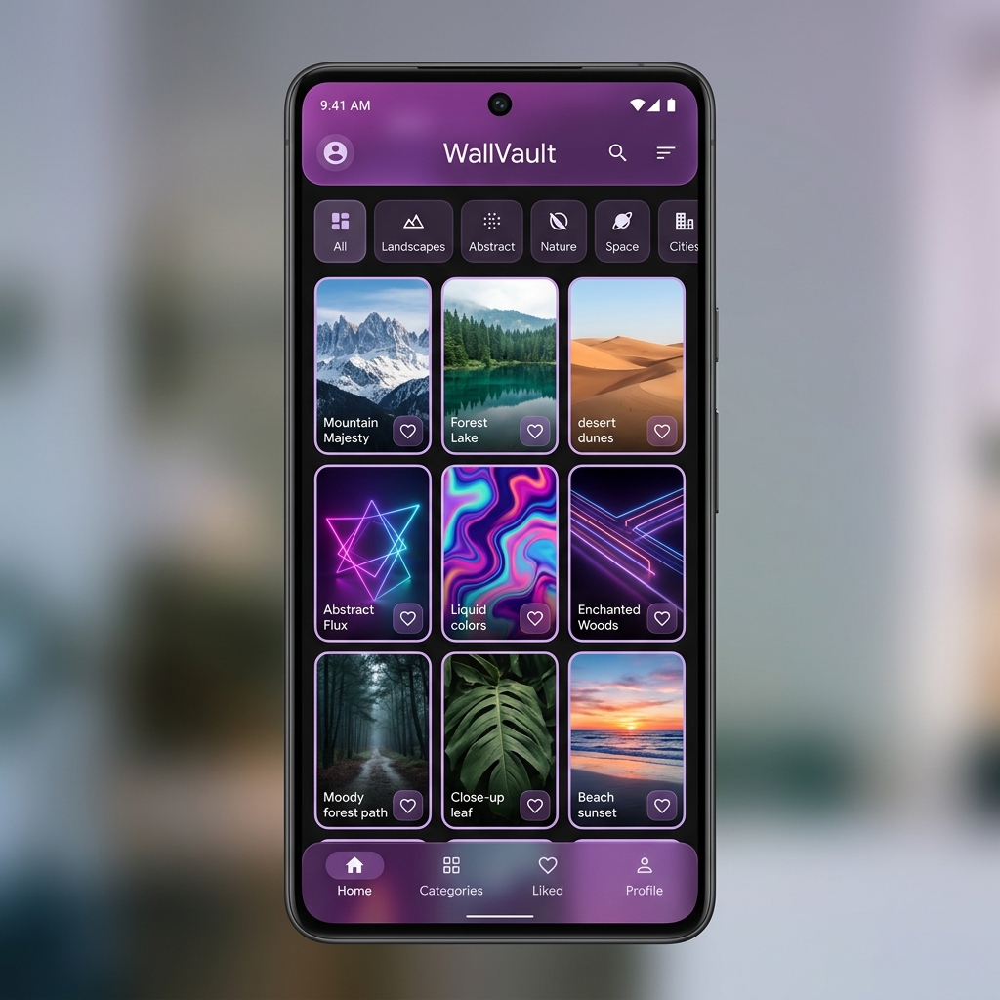
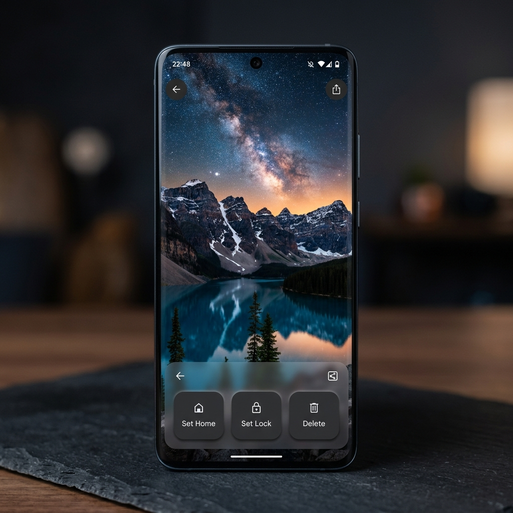

# WallVault 🌌

> A beautifully crafted, fully offline Flutter Android application strictly dedicated to managing, viewing, and organizing your personal wallpaper collection, securely separate from the system gallery.

---

## 📸 Screenshots

| Home Gallery | Wallpaper Preview & Actions |
| --- | --- |
|  |  |

---

## ✨ Features

- **Offline Gallery:** Keep your private wallpaper collection stored locally, separated from standard photos.
- **Modern UI/UX:** Stunning Material 3 design, complete with glassmorphism effects, fluid navigation, and a slick dark-mode native interface.
- **One-Tap Wallpaper Setup:** Set images to your Home Screen, Lock Screen, or Both. 
- **Bulk & Single Operations:** Add, import, and delete single images or multiple images in rapid succession.
- **Immersive Fullscreen Previews:** Inspect your highest resolution wallpapers dynamically without clutter, using our beautiful blurred overlay system to trigger operations.

---

## 🏗️ Architecture

The app was engineered under the principles of **Clean Architecture** for seamless scalability and separation of concerns.

```
lib/
 ├── core/          # Utilities, configuration, app-wide constants
 ├── data/          # Local repositories, data models, file access datasources
 ├── domain/        # Business logic, entities, pure use cases
 └── presentation/  # Feature screens, UI widgets, Provider state layers
```

---

## 🛠️ Built With

- **Flutter / Dart**
- **Material 3 Design System**
- `provider`: Core State Management
- `image_picker`: Device gallery sourcing
- `path_provider`: Secure local isolated storage management

---

## 🚀 Getting Started

To spin this project up locally or compile it onto your Android device:

1. **Pre-requisite**: Ensure [Flutter SDK](https://flutter.dev/docs/get-started/install) is installed and available in your `PATH`.
2. Clone this repository safely:
   ```bash
   git clone https://github.com/YOUR_USERNAME/Wallvault.git
   cd Wallvault
   ```
3. Fetch required packages and initialize bindings:
   ```bash
   flutter pub get
   ```
4. Build the development version onto your connected device/emulator:
   ```bash
   flutter run
   ```
5. Or, bundle a sleek production APK:
   ```bash
   flutter build apk --release
   ```

---

## 🛡️ Required Permissions
On Android, you may be prompted to allow **Storage/Media Permissions** (`READ_EXTERNAL_STORAGE` / `READ_MEDIA_IMAGES`) so the app can ingest the wallpapers you wish to import from your native Gallery. None of this data is transmitted outward.
